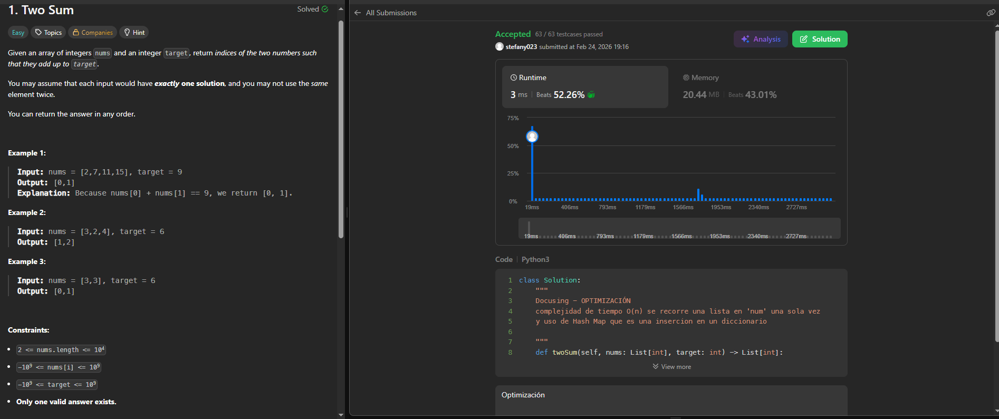

## SOLUCIÓN

### Enlace al problema en LeetCode: 
  https://leetcode.com/problems/two-sum/


### Código de la solución fuerza bruta:
class Solution:

    """
    Docusing - FUERZA BRUTA
    complejidad de tiempo O(n2) se tiene dos bucles anidados
    se debe hacer nxn comparaciones
    """
    def twoSum(self, nums: List[int], target: int) -> List[int]:
        n = len(nums)
        for i in range(n):
            for j in range(i + 1, n):
                if nums[i] + nums[j] == target:
                    return [i, j]
        return []
 
### Código de la solución optima:
```python
class Solution:
    def twoSum(self, nums: List[int], target: int) -> List[int]:
        num_map = {}
        for i, num in enumerate(nums):
            complemento = target - num
            if complemento in num_map:
                return [num_map[complemento], i]
            num_map[num] = i
        return []
```
### Pantallazo o comprobante de Accepted:  


### complejidad 
    Docusing - optima
    complejidad de tiempo O(n) se recorre una lista en 'num' una sola vez
    y uso de Hash Map que es una insercion en un diccionario 
