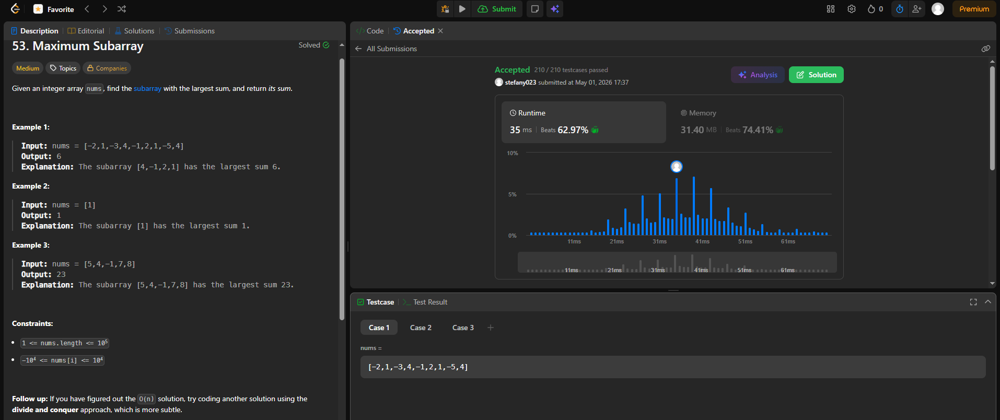

## SOLUCIÓN

### Enlace al problema en LeetCode: 
  [https://leetcode.com/problems/two-sum/](https://leetcode.com/problems/maximum-subarray/)

### Código de la solución:

class Solution:

    """
    def maxSubArray(self, nums: list[int]) -> int:
        # dp[i] representará la suma máxima del subarreglo que termina en i
        # Usamos variables para optimizar espacio a O(1)
        current_sum = nums[0]
        max_so_far = nums[0]
        
        for i in range(1, len(nums)):
            # Decisión: ¿Empiezo de nuevo en nums[i] o sigo sumando?
            current_sum = max(nums[i], current_sum + nums[i])
            # Guardamos el mejor resultado global visto hasta ahora
            max_so_far = max(max_so_far, current_sum)
            
        return max_so_far
 
### Pantallazo o comprobante de Accepted:  

### Analisis complejidad

        * Tiempo: O(n). Recorremos el arreglo una sola vez. Comparado con la fuerza bruta (O(n^2)), esta optimización es masiva para arreglos grandes.
        * Espacio: O(1). Solo necesitamos dos variables (current_sum y max_so_far) para llevar el registro, sin importar el tamaño de la entrada.
