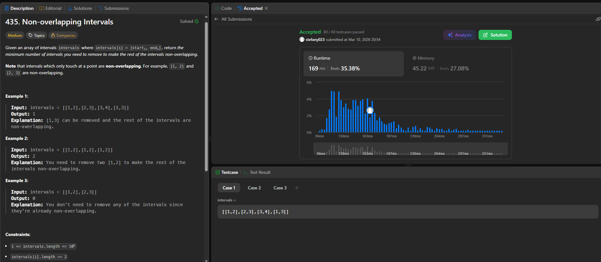

## SOLUCIÓN

### Enlace al problema en LeetCode: 
 https://leetcode.com/problems/non-overlapping-intervals/

### Código de la solución:

class Solution(object):
    def eraseOverlapIntervals(self, intervals):

        if not intervals:
            return 0
        
        intervals.sort(key=lambda x: x[1])
        
        count_removed = 0
        last_end = intervals[0][1]
        
        for i in range(1, len(intervals)):
            current_start = intervals[i][0]
            current_end = intervals[i][1]
            if current_start < last_end:
                count_removed += 1
            else:
                last_end = current_end
        return count_removed
 
### Pantallazo o comprobante de Accepted:  

### Analisis complejidad

        Complejidad tiempo: O(nlogn) La mayor parte del trabajo ocurre al ordenar los intervalos según su tiempo de finalización. 
        Una vez ordenados, el algoritmo simplemente los compara uno por uno en una sola pasada para identificar cuáles se solapan.

        Complejidad espacio: O(1) El uso de memoria es mínimo y fijo. Solo necesitamos guardar el conteo de intervalos eliminados y el tiempo de fin del último intervalo aceptado. 
        No importa cuántosintervalos recibamos, el consumo de memoria extra será siempre el mismo.

### Justificación greedy 

        Al elegir el intervalo que termina más pronto, dejamos el máximo tiempo libre restante para acomodar otros intervalos. 
        Cualquier otra elección (elegir un intervalo que termine después) solo podría reducir las opciones para los intervalos futuros. Por lo tanto, 
        la elección local de "terminar lo antes posible" asegura que no estamos bloqueando de forma innecesaria intervalos que vienen después..
