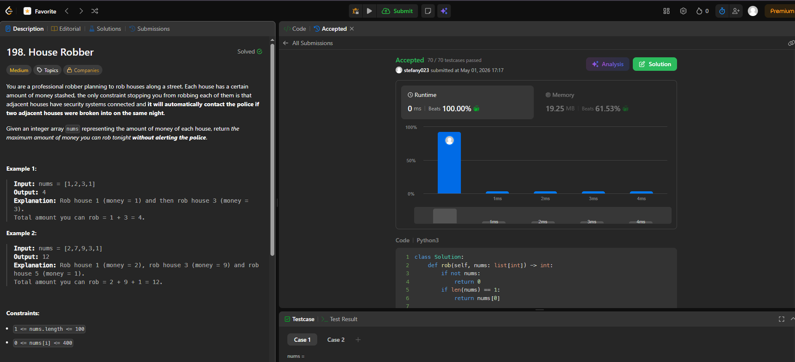
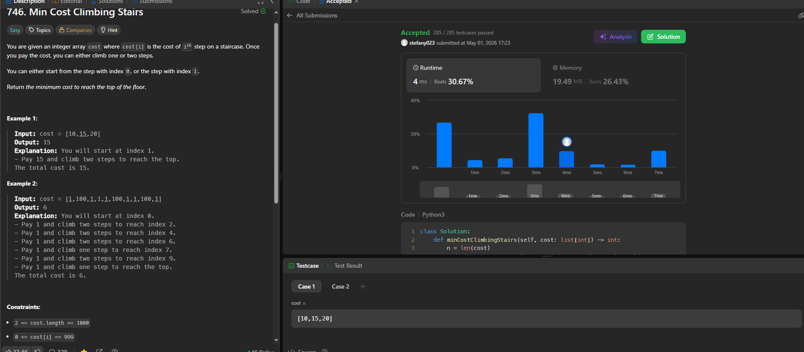

## SOLUCIÓN TAREA 4

### Enlace al problema en LeetCode: 
  https://leetcode.com/problems/house-robber/

### Código de la solución:

class Solution:

    def rob(self, nums: list[int]) -> int:
        if not nums:
            return 0
        if len(nums) == 1:
            return nums[0]
        
        # Optimizamos espacio usando dos variables en lugar de un arreglo completo
        prev_max = 0  # dp[i-2]
        curr_max = 0  # dp[i-1]
        
        for money in nums:
            # En cada paso, decidimos: 
            # 1. Robar esta casa (money + lo acumulado hace dos casas)
            # 2. No robarla (mantener lo acumulado hasta la casa anterior)
            temp = max(curr_max, prev_max + money)
            prev_max = curr_max
            curr_max = temp
            
        return curr_max
 
### Pantallazo o comprobante de Accepted:  

### Analisis complejidad

        * Tiempo: O(n), donde n es el número de casas. Solo recorremos la lista una vez.
        * Espacio: O(1). Aunque el concepto es DP, solo guardamos dos variables (prev_max y curr_max) en lugar de un arreglo de tamaño n.

### Subproblema 
        dp[i] representa la cantidad máxima de dinero que se puede obtener considerando las casas desde elíndice 0 hasta el i
        
### Recurrencia 
        dp[i] = \max(dp[i-1], dp[i-2] + nums[i])
        Donde dp[i-1] es saltar la casa actual y dp[i-2] + nums[i] es robarla
        
### Casos Base 
        dp[0] = nums[0]dp[1] = \max(nums[0], nums[1])

## SOLUCIÓN TAREA 5

### Enlace al problema en LeetCode: 
  https://leetcode.com/problems/min-cost-climbing-stairs/

### Código de la solución:

class Solution:

    def minCostClimbingStairs(self, cost: list[int]) -> int:
        n = len(cost)
        # dp[i] representará el costo mínimo para llegar al escalón i
        # Podemos optimizar el espacio usando solo dos variables
        prev2 = 0 # Costo para llegar al escalón 0 (antes de empezar)
        prev1 = 0 # Costo para llegar al escalón 1 (antes de empezar)
        
        for i in range(2, n + 1):
            # Para llegar al escalón i, puedo venir desde i-1 o i-2
            current_cost = min(prev1 + cost[i-1], prev2 + cost[i-2])
            prev2 = prev1
            prev1 = current_cost
            
        return prev1
 
### Pantallazo o comprobante de Accepted:  

### Analisis complejidad

        * Tiempo: O(n), donde n es la longitud del arreglo cost. Iteramos una sola vez desde el escalón 2 hasta n
        * Espacio: O(1). Solo mantenemos los costos de los dos escalones previos para calcular el actual.

### Subproblema 
        dp[i] representa el costo mínimo acumulado para alcanzar el escalón i. El objetivo final es alcanzar
        el escalón n (el tope, fuera del arreglo).
        
### Recurrencia 
        dp[i] = \min(dp[i-1] + cost[i-1], dp[i-2] + cost[i-2])
        
### Casos Base 
        dp[0] = 0 (empezamos en el escalón 0 sin costo).dp[1] = 0 (también podemos empezar en el escalón 1
        sin costo).

        
